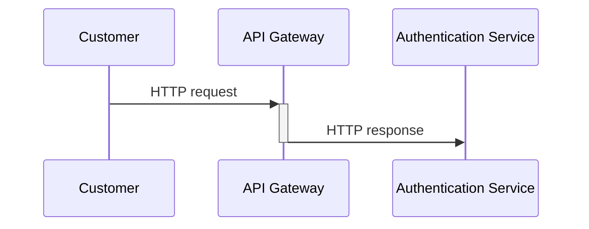
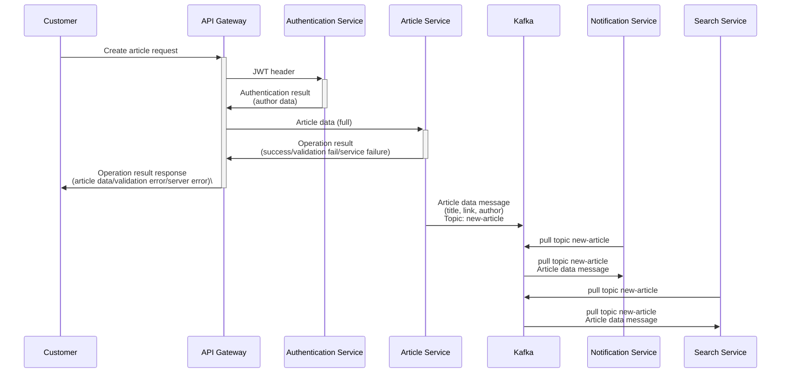
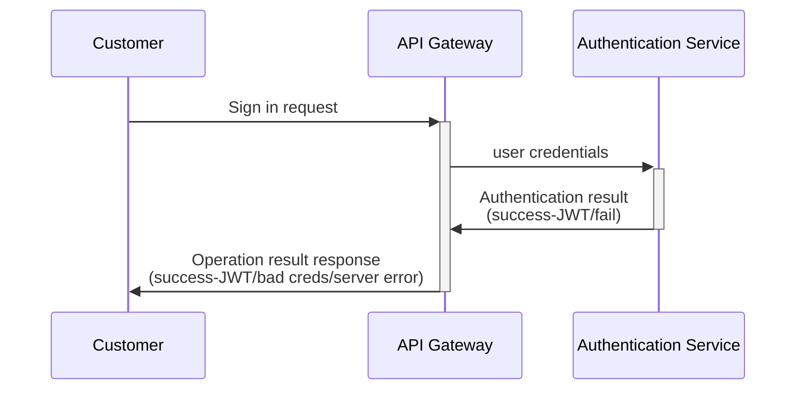

# Article platform
Article platform with SOA approach.

## Goals
- [x] Design the web application with SOA approach
- [ ] OpenTelemetry distributed traces
- [ ] Metrics
- [ ] k8s deployment
- [ ] Docker compose

## Environment setup
TBD

## Services design
All requests go through API gateway

### Get article request
```mermaid
sequenceDiagram
    participant Customer
    participant API Gateway
    participant Authentication Service
    participant Article Service
    participant Notification Service
    
    Customer ->>+API: GET article request
    API Gateway ->>+Authentication Service:JWT header
    Authentication Service ->>-API Gateway:Authentication result <br>(user data)
    API Gateway ->>+Article Service: Request query
    Article Service ->>-API Gateway: Article data
    API Gateway ->>+Notification Service: User ID
    Notification Service ->>-API Gateway: Notifications
    API Gateway ->>-Customer:Article response<br>(article, permissions, notifications)
```
### Create article

### User sign in


## Platform design

### Step 1: Identify the services and their functionalities

- [ ] **Authentication Service**: Handles user authentication and authorization
- [ ] **Article Service**: Handles article creation, retrieval, and rating
- [ ] **Notification Service**: Handles sending notifications to users about article updates  
- [ ] **Search Service**: Handles article search functionality  
- [ ] **Kafka Service**: Message broker for communication between services

### Step 2: Define the communication protocol between services
We will use **grpc** for communication between services. This will allow us to define the service interface using Protocol Buffers and generate client and server stubs in multiple programming languages.  
Each service will have its own set of grpc APIs that will define the service functionality.  

### Step 3: Define the Kafka topics for communication between services
We will use **Apache Kafka** as the message broker to handle communication between services.  
We will define topics for each service to publish and subscribe to.  
For example, the Article Service will publish new article events to the "new-article" topic, and the Notification Service will subscribe to this topic to send notifications to users.  

### Step 4: Define the web application architecture
We will create a web application that will interact with the services using grpc APIs.  
The web application will have the following components:  
Frontend: Handles user interaction and rendering (swagger)  
Backend API: Handles communication with the services using grpc APIs  
Authentication Service: Handles user authentication and authorization  
Article Service: Handles article creation, retrieval, and rating  

### Step 5: Define the communication between the web application and services
The web application will use grpc APIs to communicate with the Authentication and Article Services.  
Authentication Service will handle user authentication and authorization, and the Article Service will handle article creation, retrieval, and rating.  
The web application will use a reverse proxy to handle communication between the frontend and backend API.

### Step 6: Implement the services and web application
Each service will be implemented as a separate grpc server in its own container.  
The web application will be implemented as a set of containers, including the frontend, backend API, and reverse proxy.  
All services and the Kafka broker will be deployed in a Kubernetes cluster.  

### Step 7: Add picture printing feature   
We can add a picture printing feature by integrating a printing service into the system.  
The printing service can be implemented as another grpc server and added to the Kubernetes cluster.  
The web application can then use grpc APIs to communicate with the printing service to print pictures.  

### Step 8: Add tracing and metrics for required services
Observability allows us to easily troubleshoot and handle novel problems (i.e. “unknown unknowns”), and helps us answer the question, "Why is this happening?"  
The application code must emit signals such as traces, metrics, and logs. An application is properly instrumented when developers don’t need to add more instrumentation to troubleshoot an issue, because they have all of the information they need.

### Step 9: Build a kubernetes deployment
Kubernetes automates operational tasks of container management and includes built-in commands for deploying applications, rolling out changes to your applications, scaling your applications up and down to fit changing needs, monitoring your applications, and more—making it easier to manage applications.  
Kubernetes can help you streamline your application deployment and management process, while also improving its scalability, availability, and efficiency.


